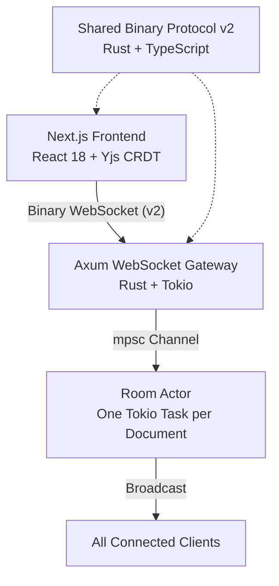

# Lattice - CRDT Collaborative Text Editor

A real-time collaborative editor with Markdown and comments support, built on CRDT synchronization, a Rust actor-model backend, and a custom binary WebSocket protocol.

Multiple users can edit the same document simultaneously across two modes: a plain text editor and a live-preview Markdown editor. Comments are anchored to text ranges using Yjs relative positions so they survive concurrent edits.

---

## Features

**Collaborative Markdown**
- Toggle between plain text and Markdown mode from the toolbar
- Split-pane layout: editable source on the left, live rendered preview on the right
- Preview updates in real time across all connected clients
- Full GitHub Flavored Markdown: tables, task lists, fenced code blocks, footnotes
- Syntax highlighting via highlight.js; HTML sanitized via rehype-sanitize
- LaTeX math via KaTeX: `$inline$` and `$$display$$` syntax, Obsidian-compatible — dollar signs hide on non-cursor lines and render live using Computer Modern font

**Collaborative Comments**
- Threaded comments with replies, reactions, and resolve/unresolve
- Anchored to text selections using `Y.RelativePosition` — anchors remain stable under concurrent edits
- Comments sidebar with unread count, active highlight, and resolved thread filtering
- Concurrent replies from multiple users merge correctly via CRDT

**Real-time Presence**
- Live collaborator avatars with cursor positions
- Reconnect-safe: late joiners replay accumulated document state on join

---

## Architecture



**Update flow (strict per CLAUDE.md):**

```
Client -> Gateway -> Room Actor -> Broadcast -> Clients -> (Persistence Pipeline)
```

This flow is never bypassed. The Room Actor is the single writer for all document state.

---

## Tech Stack

| Layer | Technology |
|---|---|
| Frontend | Next.js 14, React 18, Yjs |
| Markdown | remark, remark-gfm, remark-math, rehype-highlight, rehype-katex, rehype-sanitize |
| Math | KaTeX (inline + display, Computer Modern font) |
| Backend | Rust, Axum, Tokio |
| Transport | WebSockets (binary frames) |
| Protocol | Shared Rust + TypeScript binary format |
| Concurrency | Actor model — one Tokio task per room |
| Benchmarking | HDR histogram multi-client harness |

---

## Protocol

Binary frame layout: `[version:1][opcode:1][flags:1][room_id:16][payload_len:4][payload:n]`

Current version: **2** (bumped from v1 when execution opcodes were added).

| Opcode | Value | Direction | Purpose |
|---|---|---|---|
| Connect | 0x01 | C->S | Join room |
| Update | 0x02 | C->S | Yjs CRDT update |
| Broadcast | 0x03 | S->C | Fan-out CRDT update |
| Presence | 0x04 | C↔S | Cursor/awareness state |
| Heartbeat | 0x05 | — | Keep-alive |
| Sync | 0x06 | S->C | State replay start |
| SyncComplete | 0x07 | S->C | State replay done |
| Disconnect | 0x08 | C->S | Leave room |
<!-- Execution opcodes (cell execution, streaming output, cancel) removed from frontend docs. -->

The protocol definition is the single source of truth in `shared/` and is mirrored identically in Rust and TypeScript.

---

## Quickstart

### Prerequisites

- Rust ≥ 1.78 (`rustup update`)
- Node.js ≥ 20
- Python 3 (optional)
- npm ≥ 9

### 1. Start the backend

```bash
cargo run -p lattice-backend
# Listening on 0.0.0.0:3001
```

### 2. Start the frontend

```bash
npm install
npm run dev --workspace=frontend
# Running on http://localhost:3000
```

### 3. Open in browser

Go to [http://localhost:3000](http://localhost:3000), create a room, then open the same URL in a second tab to collaborate in real time.

---

## Development

```bash
npm install
cargo test
npm run typecheck --workspace=frontend
npm run build --workspace=frontend
cargo build
```

### Environment

```bash
cp .env.example .env
```

Defaults:
- `PORT=3001`
- `NEXT_PUBLIC_WS_URL=ws://localhost:3001/ws`

---

## Benchmarking

The benchmark harness opens N concurrent WebSocket clients against a single room and measures round-trip latency using HDR histograms.

```bash
make bench          # 10 clients, 200 messages each
make bench-stress   # 100 clients, 1000 messages, 256B payload

# Custom run
cargo run --release -p lattice-bench -- \
  --url ws://localhost:3001/ws \
  --clients 50 \
  --messages 1000 \
  --payload-bytes 128
```

Example output:

```text
lattice-bench  clients=10 messages=200 payload=64B room=<uuid>

─────────────────────────────────────────
Results
─────────────────────────────────────────
  Duration      : 1.23s
  Messages sent : 2000
  Broadcasts rx : 1800
  Errors        : 0
  Throughput    : 1626 msg/s

RTT latency (client -> server -> client echo):
  p50  : 0.91ms
  p95  : 2.14ms
  p99  : 4.87ms
  max  : 9.22ms
─────────────────────────────────────────
```

---

## Repo Structure

```text
lattice/
├── backend/          Rust Axum gateway + Room Actor
├── bench/            Multi-client benchmarking suite
├── shared/
│   ├── src/          Rust binary protocol definition
│   └── js/src/       TypeScript mirror (identical wire format)
├── frontend/
│   └── src/
│       ├── app/      Next.js routes + global styles
│       ├── components/
│       │   ├── Editor.tsx           Top-level orchestrator (mode + comments)
│       │   ├── TextEditor.tsx       Plain text / Markdown source pane
│       │   ├── MarkdownPreview.tsx  Live rehype render of Y.Text
│       │   ├── CommentsPane.tsx     Comments sidebar
│       │   ├── CommentThread.tsx    Thread + replies (CRDT-backed)
│       │   ├── CommentComposer.tsx  Compose / reply form
│       │   ├── CursorOverlay.tsx    RAF-loop cursor rendering
│       │   ├── Toolbar.tsx          Mode toggle + presence avatars
│       │   └── StatusBar.tsx        Connection state + word count
│       └── lib/
│           ├── lattice-provider.ts  WebSocket client + Yjs bridge
│           ├── markdown.ts          remark -> rehype rendering pipeline
│           └── utils.ts             UUID, color hashing
├── infra/            docker-compose for supporting services
└── docs/             Architecture notes
```


